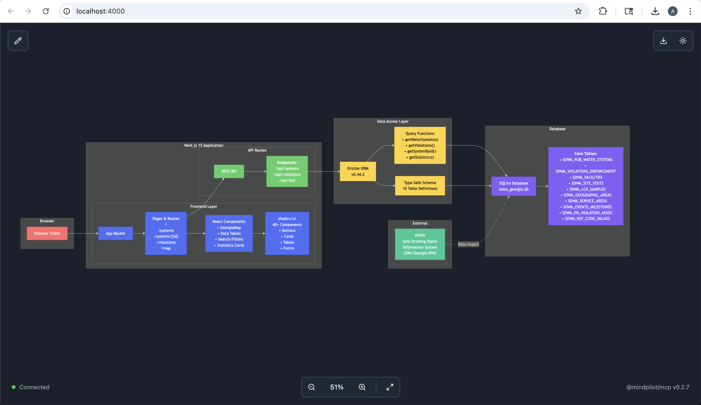
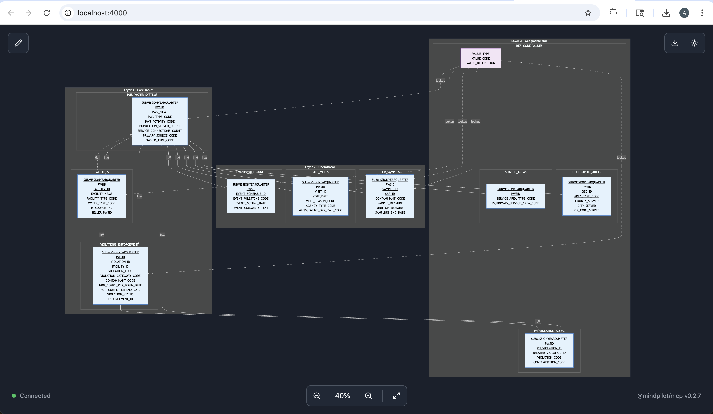
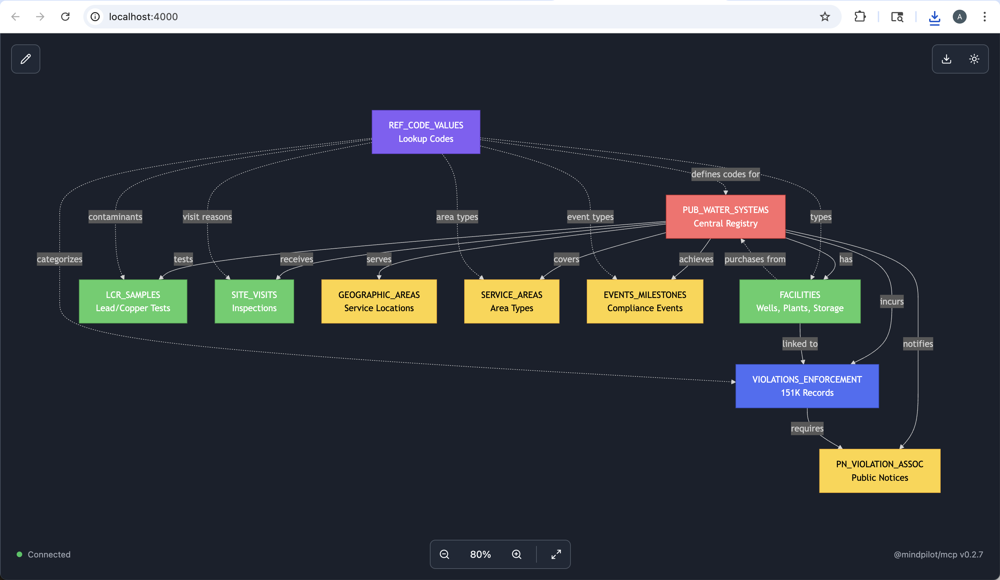
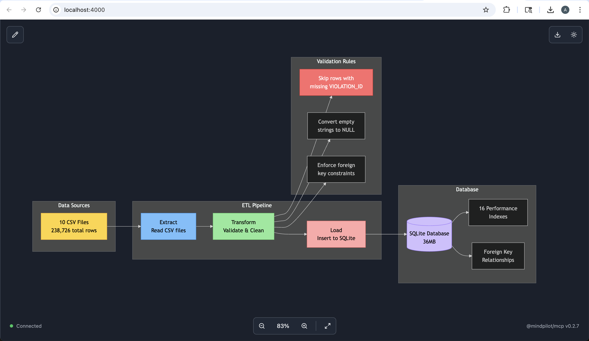

# Georgia Safe Drinking Water Monitoring System

A comprehensive web application for monitoring and tracking drinking water quality compliance across Georgia's public water systems, built with Next.js 15 and powered by EPA's Safe Drinking Water Information System (SDWIS) data.

## 🚰 Overview

This application provides real-time insights into Georgia's drinking water infrastructure, helping regulators, water system operators, and the public track:

- **Water System Compliance** - Monitor violations and enforcement actions
- **System Performance** - Track inspection results and water quality metrics
- **Geographic Distribution** - Visualize water systems and violations across Georgia
- **Lead & Copper Testing** - Review LCR (Lead and Copper Rule) sample results
- **Regulatory Milestones** - Track important dates and compliance deadlines

## 🏗️ Architecture



The application follows a modern, scalable architecture:

- **Frontend**: Next.js 15 with App Router for server-side rendering and optimal performance
- **UI Components**: shadcn/ui component library built on Radix UI primitives
- **Database**: SQLite for reliable, serverless data storage
- **ORM**: Drizzle ORM for type-safe database queries
- **Styling**: Tailwind CSS for responsive, utility-first design

## 📊 Database Design



The database schema captures comprehensive water system data:



Key entities include:
- Public Water Systems (PWS) with population served and system types
- Violations and enforcement actions with health-based categorization
- Site visits and inspection records
- Lead and Copper Rule (LCR) sampling results
- Geographic service areas and facility locations

## 🔄 Data Pipeline



Data flows from EPA's SDWIS through an ETL process that:
1. Extracts regulatory data from state and federal sources
2. Transforms and validates data for consistency
3. Loads into the SQLite database for fast querying

## 🚀 Getting Started

### Prerequisites

- Node.js 18+ 
- npm or yarn package manager

### Installation

1. Clone the repository
```bash
git clone https://github.com/yourusername/speedtrials-2025.git
cd speedtrials-2025
```

2. Install dependencies
```bash
cd packages/web
npm install
```

3. Run the development server
```bash
npm run dev
```

4. Open [http://localhost:3000](http://localhost:3000) in your browser

## 🛠️ Development

### Available Scripts

```bash
npm run dev         # Start development server
npm run build       # Build for production
npm run start       # Start production server
npm run lint        # Run ESLint
npm run typecheck   # Run TypeScript compiler
npm run format      # Format code with Prettier
npm run db:studio   # Open Drizzle Studio for database management
```

### Project Structure

```
speedtrials-2025/
├── packages/
│   └── web/                    # Next.js web application
│       ├── src/
│       │   ├── app/           # App Router pages and API routes
│       │   ├── components/    # React components
│       │   ├── db/           # Database connection and queries
│       │   └── lib/          # Utilities and helpers
│       ├── public/           # Static assets
│       └── package.json      # Dependencies and scripts
├── gallery/                   # Documentation images
├── CLAUDE.md                 # AI assistant instructions
├── WEB_SPEC.md              # Detailed specifications
└── SDWA_Data_Model.md       # Database schema documentation
```

## 📱 Features

### Dashboard
- Real-time statistics on active water systems
- Compliance rate calculations
- Recent violations with severity indicators
- Largest systems by population served

### Water Systems Management
- Search and filter 1,500+ water systems
- Detailed system profiles with compliance history
- Export capabilities for reporting

### Violation Tracking
- Categorized by health-based vs monitoring violations
- Status tracking (addressed/unaddressed)
- Historical violation trends

### Geographic Visualization
- Interactive map of water system locations
- Service area boundaries
- Violation hotspot identification

## 🔒 Security & Compliance

- Read-only database access for data integrity
- Secure API endpoints with proper validation
- Compliance with Safe Drinking Water Act regulations
- No storage of sensitive personal information

## 📖 Documentation

- [Web Application Specifications](WEB_SPEC.md)
- [Database Schema](SDWA_Data_Model.md)
- [Development Guidelines](CLAUDE.md)
- [ETL Process Documentation](PROCESS.md)

## 🤝 Contributing

Contributions are welcome! Please read our contributing guidelines and submit pull requests to the `main` branch.

## 📄 License

This project is licensed under the MIT License - see the LICENSE file for details.

## 🙏 Acknowledgments

- EPA's Safe Drinking Water Information System (SDWIS) for providing the data
- Georgia Environmental Protection Division for state-level data
- The open source community for the amazing tools and libraries

---

Built with ❤️ for clean, safe drinking water in Georgia