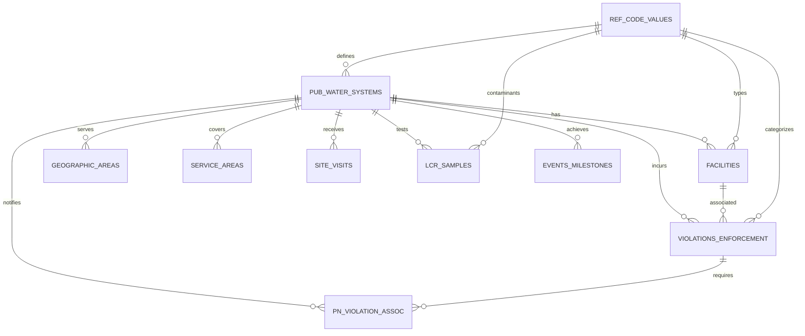

# SDWA Data Model Documentation

## Overview

This document describes the data model for the Safe Drinking Water Act (SDWA) Information System data for Georgia Q1 2025. The model consists of 10 core tables and 1 reference table that track public water systems, their compliance with drinking water regulations, violations, enforcement actions, and water quality testing results.

## Key Concepts

### Composite Primary Keys
Most tables use a composite primary key of:
- **SUBMISSIONYEARQUARTER**: Fiscal year + quarter (e.g., "2025Q1")
- **PWSID**: Public Water System ID (2-letter state code + 7 digits)

This allows tracking the same water system across different quarterly snapshots.

### Temporal Data
The system maintains historical snapshots by quarter, allowing trend analysis and compliance tracking over time.

## Entity Relationship Diagram

## Core Entities

### 1. SDWA_PUB_WATER_SYSTEMS
**Purpose**: Master registry of all public water systems in Georgia

**Primary Key**: SUBMISSIONYEARQUARTER, PWSID

**Key Attributes**:
- PWS_NAME (varchar 100)
- PWS_TYPE_CODE (varchar 6): CWS, TNCWS, NTNCWS
- PWS_ACTIVITY_CODE (char 1): A=Active, I=Inactive, etc.
- POPULATION_SERVED_COUNT (numeric)
- SERVICE_CONNECTIONS_COUNT (numeric)
- OWNER_TYPE_CODE (char 1): F=Federal, L=Local, P=Private, etc.
- PRIMARY_SOURCE_CODE (varchar 4): GW, SW, GWP, SWP, GU, GUP
- Administrative contact info (name, email, phone, address)

**Row Count**: ~5,648

### 2. SDWA_FACILITIES
**Purpose**: Physical facilities (wells, treatment plants, storage) for each water system

**Primary Key**: SUBMISSIONYEARQUARTER, PWSID, FACILITY_ID

**Key Attributes**:
- FACILITY_NAME (varchar 100)
- FACILITY_TYPE_CODE (varchar 4): WL=Well, TP=Treatment Plant, etc.
- FACILITY_ACTIVITY_CODE (char 1): Active/Inactive status
- WATER_TYPE_CODE (varchar 4): GW, SW, GU
- IS_SOURCE_IND (char 1): Y/N
- SELLER_PWSID (varchar 9): For purchased water

**Row Count**: ~22,536

### 3. SDWA_VIOLATIONS_ENFORCEMENT
**Purpose**: Compliance violations and enforcement actions taken

**Primary Key**: SUBMISSIONYEARQUARTER, PWSID, VIOLATION_ID

**Key Attributes**:
- VIOLATION_CODE (varchar 4)
- VIOLATION_CATEGORY_CODE (varchar 5): MCL, TT, MR, MON, RPT
- IS_HEALTH_BASED_IND (char 1): Y/N
- CONTAMINANT_CODE (varchar 4)
- NON_COMPL_PER_BEGIN_DATE (date)
- NON_COMPL_PER_END_DATE (date): NULL if unresolved
- VIOLATION_STATUS (varchar 11): Resolved/Archived/Addressed/Unaddressed
- ENFORCEMENT_ID (varchar 20)
- ENFORCEMENT_ACTION_TYPE_CODE (varchar 4)
- ENF_ACTION_CATEGORY (varchar 4000): Formal/Informal/Resolving

**Row Count**: ~151,085 (largest table)

### 4. SDWA_LCR_SAMPLES
**Purpose**: Lead and Copper Rule testing results

**Primary Key**: SUBMISSIONYEARQUARTER, PWSID, SAMPLE_ID, SAR_ID

**Key Attributes**:
- SAMPLING_START_DATE (date)
- SAMPLING_END_DATE (date)
- CONTAMINANT_CODE (varchar 4): Lead or Copper
- SAMPLE_MEASURE (numeric): Test result value
- UNIT_OF_MEASURE (varchar 4)
- RESULT_SIGN_CODE (char 1): L=Less than, E=Equal to

**Row Count**: ~19,813

### 5. SDWA_SITE_VISITS
**Purpose**: Inspection and site visit records

**Primary Key**: SUBMISSIONYEARQUARTER, PWSID, VISIT_ID

**Key Attributes**:
- VISIT_DATE (date)
- VISIT_REASON_CODE (varchar 4)
- AGENCY_TYPE_CODE (varchar 2): Who conducted visit
- Evaluation codes for different areas (M=Minor, S=Significant, etc.):
  - MANAGEMENT_OPS_EVAL_CODE
  - SOURCE_WATER_EVAL_CODE
  - TREATMENT_EVAL_CODE
  - DISTRIBUTION_EVAL_CODE
  - FINANCIAL_EVAL_CODE

**Row Count**: ~17,439

### 6. SDWA_GEOGRAPHIC_AREAS
**Purpose**: Service area geographic information

**Primary Key**: SUBMISSIONYEARQUARTER, PWSID, GEO_ID, AREA_TYPE_CODE

**Key Attributes**:
- AREA_TYPE_CODE (varchar 4): CN=County, CT=City, ZC=Zip
- TRIBAL_CODE (varchar 10)
- STATE_SERVED (varchar 4)
- ANSI_ENTITY_CODE (varchar 4)
- ZIP_CODE_SERVED (varchar 5)
- CITY_SERVED (varchar 40)
- COUNTY_SERVED (varchar 40)

**Row Count**: ~7,837

### 7. SDWA_SERVICE_AREAS
**Purpose**: Types of areas served by water systems

**Primary Key**: SUBMISSIONYEARQUARTER, PWSID

**Key Attributes**:
- SERVICE_AREA_TYPE_CODE (varchar 4)
- IS_PRIMARY_SERVICE_AREA_CODE (char 1): Y/N

**Row Count**: ~5,176

### 8. SDWA_EVENTS_MILESTONES
**Purpose**: Significant events and compliance milestones

**Primary Key**: SUBMISSIONYEARQUARTER, PWSID, EVENT_SCHEDULE_ID

**Key Attributes**:
- EVENT_MILESTONE_CODE (varchar 4): LSLR, SDFF, RTL1, etc.
- EVENT_REASON_CODE (varchar 4)
- EVENT_ACTUAL_DATE (date)
- EVENT_END_DATE (date)
- EVENT_COMMENTS_TEXT (varchar 2000)

**Row Count**: ~5,657

### 9. SDWA_PN_VIOLATION_ASSOC
**Purpose**: Public notification requirements for violations

**Primary Key**: SUBMISSIONYEARQUARTER, PWSID, PN_VIOLATION_ID

**Key Attributes**:
- RELATED_VIOLATION_ID (varchar 20)
- VIOLATION_CODE (varchar 4)
- CONTAMINATION_CODE (varchar 4)
- NON_COMPL_PER_BEGIN_DATE (date)
- NON_COMPL_PER_END_DATE (date)

**Row Count**: ~1,173

## Reference Tables

### SDWA_REF_CODE_VALUES
**Purpose**: Lookup table for all code values used across the system

**Primary Key**: VALUE_TYPE, VALUE_CODE

**Structure**:
- VALUE_TYPE (varchar 40): The field name (e.g., "VIOLATION_CODE")
- VALUE_CODE (varchar 40): The code value (e.g., "01")
- VALUE_DESCRIPTION (varchar 250): Human-readable description

**Categories** (with counts):
- CONTAMINANT_CODE: 871 entries
- TRIBAL_CODE: 565 entries
- ENFORCEMENT_ACTION_TYPE_CODE: 82 entries
- VIOLATION_CODE: 80 entries
- PRIMACY_AGENCY_CODE: 68 entries
- VISIT_REASON_CODE: 42 entries
- SERVICE_AREA_TYPE_CODE: 28 entries
- FACILITY_TYPE_CODE: 22 entries
- RULE_CODE: 29 entries

**Row Count**: ~2,362

### SDWA_REF_ANSI_AREAS (Missing)
**Note**: Referenced in documentation but not provided in the dataset

**Expected Structure**:
- ANSI_STATE_CODE (char 2)
- ANSI_ENTITY_CODE (char 3)
- ANSI_NAME (varchar 40)
- STATE_CODE (char 2)

## Data Types Summary

| Type | Format | Example |
|------|--------|---------|
| Dates | MM/DD/YYYY | 03/20/2025 |
| IDs | Alphanumeric | GA0010000 |
| Codes | Fixed char | A, CWS, 01 |
| Measures | Numeric | 5.5 |
| Text | Variable char | System names, comments |

## Indexing Strategy

### Primary Indexes
All tables have composite primary keys on:
- SUBMISSIONYEARQUARTER + PWSID + [Additional ID fields]

### Recommended Secondary Indexes
1. **Temporal Queries**:
   - NON_COMPL_PER_BEGIN_DATE, NON_COMPL_PER_END_DATE (violations)
   - VISIT_DATE (site visits)
   - SAMPLING_END_DATE (LCR samples)

2. **Status/Type Filters**:
   - PWS_ACTIVITY_CODE, PWS_TYPE_CODE (water systems)
   - VIOLATION_STATUS, IS_HEALTH_BASED_IND (violations)
   - FACILITY_TYPE_CODE, IS_SOURCE_IND (facilities)

3. **Geographic Queries**:
   - ZIP_CODE_SERVED, COUNTY_SERVED (geographic areas)
   - EPA_REGION, PRIMACY_AGENCY_CODE (water systems)

4. **Lookup Performance**:
   - VALUE_TYPE in REF_CODE_VALUES
   - CONTAMINANT_CODE, VIOLATION_CODE (frequently joined)

## Data Quality Considerations

1. **Null Handling**:
   - NON_COMPL_PER_END_DATE is NULL for unresolved violations
   - Many optional fields (phone extensions, fax numbers)

2. **Temporal Consistency**:
   - All tables snapshot data quarterly
   - Historical tracking via FIRST_REPORTED_DATE/LAST_REPORTED_DATE

3. **Referential Integrity**:
   - All code fields should reference SDWA_REF_CODE_VALUES
   - SELLER_PWSID should reference valid PUB_WATER_SYSTEMS
   - Missing ANSI reference table may cause lookup issues

4. **Data Volume**:
   - Violations table is 65% of total records
   - Quarterly snapshots will multiply data volume over time